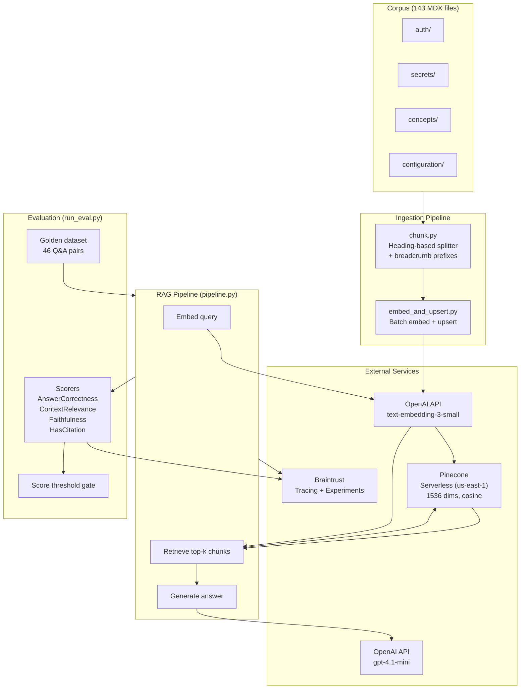
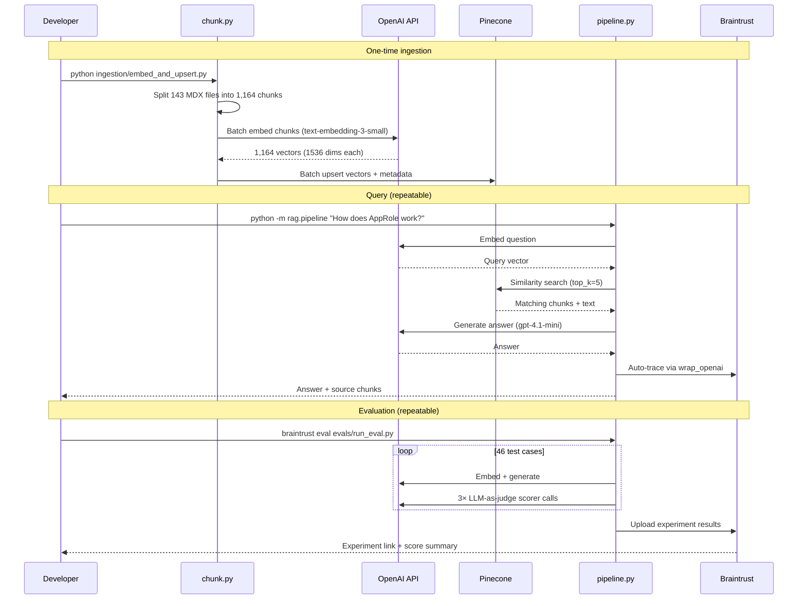
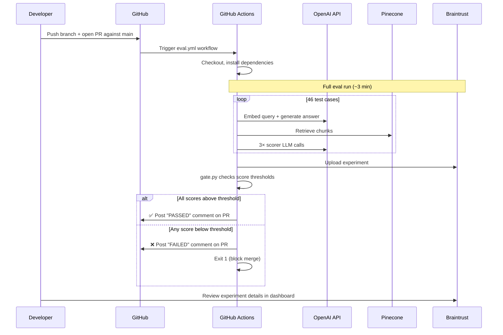

# Vault RAG Demo with Braintrust Evaluation

A complete RAG (Retrieval-Augmented Generation) pipeline built on HashiCorp Vault v1.9.x documentation, with end-to-end evaluation and CI/CD quality gates powered by [Braintrust](https://www.braintrust.dev).

This project demonstrates the full lifecycle: **ingest → chunk → embed → retrieve → generate → evaluate → iterate → gate PRs** — the same pattern used by engineering teams at companies like Stripe and Notion to ship AI features with confidence.

## Architecture



## How It Works

### Local Development Workflow



### CI/CD Workflow



## Prerequisites

- Python 3.12+
- API keys for:
  - [OpenAI](https://platform.openai.com/api-keys) — embeddings and generation
  - [Pinecone](https://app.pinecone.io/) — vector database (free tier works)
  - [Braintrust](https://www.braintrust.dev/) — evaluation and tracing (free tier works)

## Setup

### 1. Clone and install

```bash
git clone https://github.com/soldatchenko/braintrust-demo.git
cd braintrust-demo

python3 -m venv .venv
source .venv/bin/activate
pip install -r requirements.txt
```

### 2. Configure environment

```bash
cp .env.example .env
# Edit .env with non-sensitive config (index name, etc.)

# Set sensitive keys in your shell:
export OPENAI_API_KEY=sk-...
export PINECONE_API_KEY=pcsk_...
export BRAINTRUST_API_KEY=sk-...
```

### 3. Create a Pinecone index

The index must match the embedding model's dimensions:

```bash
python -c "
from pinecone import Pinecone, ServerlessSpec
import os

pc = Pinecone(api_key=os.environ['PINECONE_API_KEY'])
pc.create_index(
    name='vault-rag-demo',
    dimension=1536,           # text-embedding-3-small output size
    metric='cosine',          # direction-based similarity
    spec=ServerlessSpec(cloud='aws', region='us-east-1'),
)
print('Index created.')
"
```

> **Why these settings?** Dimension is locked to the embedding model (1536 for `text-embedding-3-small`). Cosine metric measures direction similarity, which is the safe default for text embeddings. Changing the embedding model requires recreating the index and re-embedding all chunks.

### 4. Ingest the corpus

The corpus (143 Vault MDX documentation files) is included in the repo under `corpus/`.

```bash
# Chunk and embed all docs into Pinecone
PINECONE_INDEX_NAME=vault-rag-demo python ingestion/embed_and_upsert.py --corpus ./corpus

# To re-embed from scratch (clears existing vectors first):
PINECONE_INDEX_NAME=vault-rag-demo python ingestion/embed_and_upsert.py --corpus ./corpus --clear
```

This produces 1,164 chunks (avg 236 tokens each) and costs ~$0.006 in OpenAI embeddings.

## Usage

### Ask questions

```bash
PINECONE_INDEX_NAME=vault-rag-demo python -m rag.pipeline "What is the seal/unseal process in Vault?"
```

Example output:

```
Question: What is the seal/unseal process in Vault?

============================================================
ANSWER:
============================================================
The seal/unseal process in Vault involves protecting and accessing the master
key that decrypts Vault's data. When Vault starts, it is in a sealed state
where it knows how to access storage but cannot decrypt data. Unsealing is the
process of reconstructing the master key by providing enough key shards (using
Shamir's Secret Sharing) to decrypt the master key and access Vault data.
Vault remains unsealed until it is resealed, restarted, or encounters a
storage error. (Sections 1, 2, 3, 4, 5)

============================================================
RETRIEVED 5 CHUNKS:
============================================================

  [1] Seal/Unseal (score: 0.789)
      Source: concepts/seal.mdx
  [2] Seal/Unseal > Unsealing (score: 0.772)
      Source: concepts/seal.mdx
  [3] Seal/Unseal > Sealing (score: 0.763)
      Source: concepts/seal.mdx
```

Every query is automatically traced in the [Braintrust dashboard](https://www.braintrust.dev) — you can see the full span tree (embed → retrieve → generate) with latencies, token counts, and costs.

### Run evaluations

```bash
PINECONE_INDEX_NAME=vault-rag-demo braintrust eval evals/run_eval.py
```

Example summary:

```
=========================SUMMARY=========================
experiment-123 compared to baseline:
90.90% (+01.72%) 'AnswerCorrectness' score    (3 improvements, 2 regressions)
75.10% (+00.61%) 'ContextRelevance'  score    (0 improvements, 0 regressions)
97.70% (-01.21%) 'Faithfulness'      score    (2 improvements, 3 regressions)
93.00% (+01.88%) 'HasCitation'       score    (1 improvements, 0 regressions)
```

Results appear in the Braintrust dashboard where you can drill into individual test cases, compare experiments side-by-side, and see which specific questions improved or regressed.

## The Iteration Loop

This is the core developer workflow. Making the pipeline better is a cycle of:

1. **Change something** — prompt wording, `top_k`, chunking strategy, scorer thresholds
2. **Run eval** — `braintrust eval evals/run_eval.py`
3. **Compare** — open the Braintrust dashboard, look at the diff vs. the previous experiment
4. **Decide** — did scores improve? Did any specific test cases regress? Merge or revert.

Examples of knobs to turn:

| Change | File | What it affects |
|---|---|---|
| System prompt wording | `rag/prompts.py` | Answer quality, citation behavior |
| Number of retrieved chunks (`top_k`) | `rag/pipeline.py` | Context coverage vs. noise |
| Chunk size / strategy | `ingestion/chunk.py` | Retrieval precision |
| Scorer rubric | `evals/scorers.py` | What "good" means |
| Test cases | `evals/dataset.json` | Coverage of edge cases |

## Evaluation Scores

| Scorer | Type | Score | What it measures |
|---|---|---|---|
| AnswerCorrectness | LLM-as-judge | 90.9% | Is the answer factually correct vs. the expected answer? |
| Faithfulness | LLM-as-judge | 97.7% | Does the answer only use information from retrieved context? |
| HasCitation | Deterministic | 93.0% | Does the answer reference source documents? |
| ContextRelevance | LLM-as-judge | 75.1% | Did retrieval find the right chunks for the question? |

**Reading these scores:**
- **High Faithfulness + lower AnswerCorrectness** → retrieval problem (right chunks not found)
- **High ContextRelevance + lower Faithfulness** → generation problem (model hallucinating despite good context)
- **Low HasCitation** → prompt issue (model not citing sources as instructed)

## Project Structure

```
braintrust-demo/
├── corpus/                    # Vault v1.9.x MDX docs (143 files, 1.3MB)
│   ├── auth/                  # Auth methods (approle, kubernetes, token, etc.)
│   ├── secrets/               # Secrets engines (kv, pki, aws, transit, etc.)
│   ├── concepts/              # Core concepts (seal, tokens, policies, leases)
│   └── configuration/         # Server config (listener, storage, seals)
├── ingestion/
│   ├── chunk.py               # Heading-based chunker with breadcrumb prefixes
│   └── embed_and_upsert.py    # Batch embed chunks → upsert to Pinecone
├── rag/
│   ├── pipeline.py            # Core RAG: embed query → retrieve → generate
│   └── prompts.py             # System prompt template (cheap to iterate on)
├── evals/
│   ├── dataset.json           # Golden eval dataset (46 Q&A pairs)
│   ├── scorers.py             # Custom scorers (3 LLM-as-judge + 1 deterministic)
│   ├── run_eval.py            # Braintrust Eval() runner
│   └── gate.py                # Score threshold gate for CI/CD
├── .github/
│   └── workflows/
│       └── eval.yml           # CI/CD eval pipeline (runs on PRs against main)
├── docs/                      # Reference architecture diagrams (HTML/JSX)
├── .env.example               # All required environment variables
├── requirements.txt           # Pinned Python dependencies
└── CLAUDE.md                  # Full project context and build history
```

## CI/CD Eval Pipeline

Every PR against `main` automatically runs the full eval suite via GitHub Actions.

### How it works

1. PR opened or updated → GitHub Actions triggers the eval workflow
2. Eval runs the full RAG pipeline against the 46-case golden dataset
3. Braintrust records the experiment (visible in the dashboard for comparison)
4. `evals/gate.py` checks scores against minimum thresholds
5. Results are posted as a PR comment with pass/fail status
6. If any score is below threshold, the PR is blocked from merging

### Score thresholds

Thresholds are set ~10-15 points below current scores to absorb normal LLM variance while catching real regressions:

| Scorer | Minimum | Current |
|---|---|---|
| AnswerCorrectness | 85% | 90.9% |
| Faithfulness | 90% | 97.7% |
| HasCitation | 85% | 93.0% |
| ContextRelevance | 60% | 75.1% |

### GitHub Secrets required

Add these in **Repo → Settings → Secrets and variables → Actions**:

| Secret | Description |
|---|---|
| `OPENAI_API_KEY` | OpenAI API key for embeddings + generation + scorer calls |
| `PINECONE_API_KEY` | Pinecone API key for vector retrieval |
| `BRAINTRUST_API_KEY` | Braintrust API key for experiment logging |

## Key Design Decisions

| Decision | Choice | Rationale |
|---|---|---|
| Chunking strategy | Heading-based (`##`) with `###` fallback, then token-count | Preserves document structure; breadcrumb prefixes maintain context across chunks |
| Embedding model | `text-embedding-3-small` (1536 dims) | Cost-effective, sufficient quality for technical docs |
| Similarity metric | Cosine | Direction-based, safe default for text; portable across embedding models |
| Retrieved chunks | `top_k=5` | Balances context coverage vs. noise; tested 5 vs. 7 via eval |
| Generation model | `gpt-4.1-mini` | Fast, cheap, sufficient for grounded RAG answers |
| Scorers | Custom LLM-as-judge | Better handling of verbose-but-correct answers and multi-chunk synthesis than autoevals built-ins |

## Troubleshooting

| Symptom | Cause | Fix |
|---|---|---|
| No traces in Braintrust UI | Missing `init_logger()` call | Ensure `braintrust.init_logger(project=...)` is called before any `@traced` functions |
| All eval scores look bad | Scorer may be too strict | Check scorer reasoning in Braintrust UI; the pipeline may be fine while the scorer rubric needs adjustment |
| ContextRelevance low, others high | Retrieval problem | Try increasing `top_k`, check chunking quality, verify query embeddings match corpus embeddings model |
| Faithfulness low, others high | Hallucination problem | Tighten the system prompt ("answer ONLY from context"), check if `top_k` is too low |
| CI fails with "Repository not found" | Missing `contents: read` permission | GitHub Actions `permissions` block replaces all defaults — must explicitly include `contents: read` |
| Gate shows "MISSING" for all scores | Gate regex doesn't match eval output | Check `eval_output.txt` for the actual format; braintrust output format may vary between versions |

## Cost Estimate

| Operation | Cost | Frequency |
|---|---|---|
| Embed full corpus (1,164 chunks) | ~$0.006 | Once (or when corpus changes) |
| Single query | ~$0.001 | Per question |
| Full eval run (46 cases) | ~$0.10-0.15 | Per experiment / CI run |
| **Total to run from scratch** | **< $1.00** | |

All services (Pinecone serverless, Braintrust, OpenAI) have free tiers sufficient for this demo.

## License

MIT — see [LICENSE](LICENSE).
