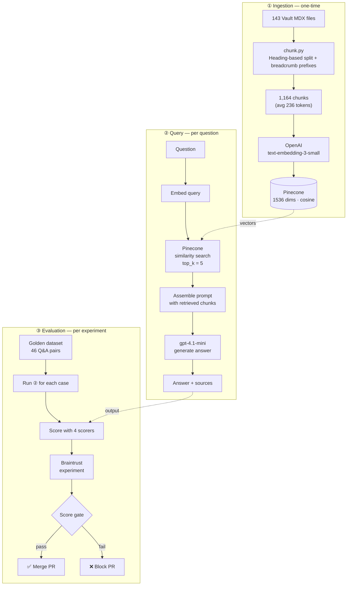
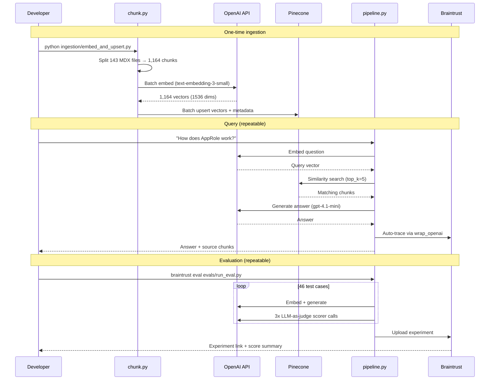
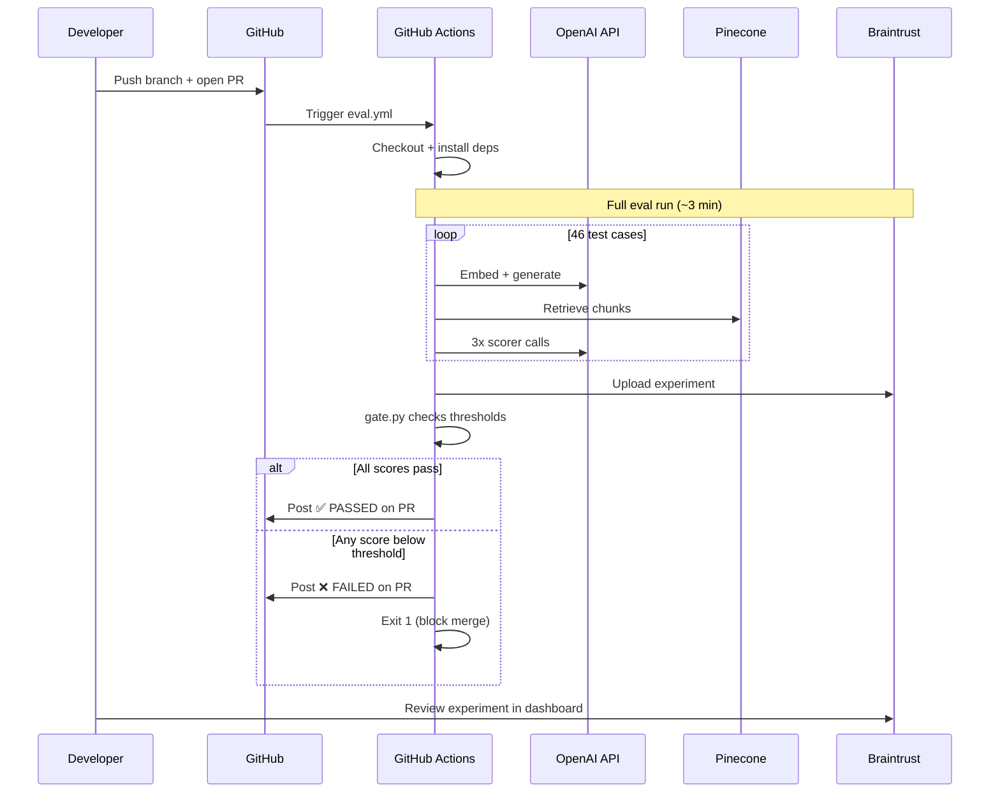

# Vault RAG Demo with Braintrust Evaluation

A complete RAG (Retrieval-Augmented Generation) pipeline built on HashiCorp Vault v1.9.x documentation, with end-to-end evaluation and CI/CD quality gates powered by [Braintrust](https://www.braintrust.dev).

Demonstrates the full lifecycle: **ingest → chunk → embed → retrieve → generate → evaluate → iterate → gate PRs** — the same pattern used by engineering teams to ship AI features with confidence.

## Architecture

Three phases, each building on the last:



## Project Structure

```
braintrust-demo/
├── corpus/                    # Vault v1.9.x MDX docs (143 files, 1.3MB)
│   ├── auth/                  # Auth methods (approle, kubernetes, token, etc.)
│   ├── secrets/               # Secrets engines (kv, pki, aws, transit, etc.)
│   ├── concepts/              # Core concepts (seal, tokens, policies, leases)
│   └── configuration/         # Server config (listener, storage, seals)
├── ingestion/
│   ├── chunk.py               # Heading-based chunker with breadcrumb prefixes
│   └── embed_and_upsert.py    # Batch embed chunks → upsert to Pinecone
├── rag/
│   ├── pipeline.py            # Core RAG: embed query → retrieve → generate
│   └── prompts.py             # System prompt template (cheap to iterate on)
├── evals/
│   ├── dataset.json           # Golden eval dataset (46 Q&A pairs)
│   ├── scorers.py             # Custom scorers (3 LLM-as-judge + 1 deterministic)
│   ├── run_eval.py            # Braintrust Eval() runner
│   └── gate.py                # Score threshold gate for CI/CD
├── .github/
│   └── workflows/
│       └── eval.yml           # CI/CD eval pipeline (runs on PRs against main)
├── docs/                      # Reference architecture diagrams (HTML/JSX)
├── .env.example               # All required environment variables
├── requirements.txt           # Pinned Python dependencies
└── CLAUDE.md                  # Full project context and build history
```

## How It Works

### Local Development



### CI/CD Quality Gate



## Getting Started

### Prerequisites

- Python 3.12+
- API keys for:
  - [OpenAI](https://platform.openai.com/api-keys) — embeddings and generation
  - [Pinecone](https://app.pinecone.io/) — vector database (free tier works)
  - [Braintrust](https://www.braintrust.dev/) — evaluation and tracing (free tier works)

### 1. Clone and install

```bash
git clone https://github.com/soldatchenko/braintrust-demo.git
cd braintrust-demo

python3 -m venv .venv
source .venv/bin/activate
pip install -r requirements.txt
```

### 2. Configure environment

```bash
cp .env.example .env
# Edit .env with non-sensitive config (index name, etc.)

# Set sensitive keys in your shell:
export OPENAI_API_KEY=sk-...
export PINECONE_API_KEY=pcsk_...
export BRAINTRUST_API_KEY=sk-...
```

### 3. Create a Pinecone index

```bash
python -c "
from pinecone import Pinecone, ServerlessSpec
import os

pc = Pinecone(api_key=os.environ['PINECONE_API_KEY'])
pc.create_index(
    name='vault-rag-demo',
    dimension=1536,           # must match embedding model
    metric='cosine',          # direction-based similarity
    spec=ServerlessSpec(cloud='aws', region='us-east-1'),
)
print('Index created.')
"
```

> **Why these settings?** Dimension (1536) is locked to the embedding model (`text-embedding-3-small`). Cosine measures directional similarity — the safe default for text. Changing the embedding model requires recreating the index and re-embedding all chunks.

### 4. Ingest the corpus

The corpus (143 Vault MDX documentation files) is included in the repo.

```bash
# Chunk and embed all docs into Pinecone
PINECONE_INDEX_NAME=vault-rag-demo python ingestion/embed_and_upsert.py --corpus ./corpus

# To re-embed from scratch (clears existing vectors first):
PINECONE_INDEX_NAME=vault-rag-demo python ingestion/embed_and_upsert.py --corpus ./corpus --clear
```

Produces 1,164 chunks (avg 236 tokens) for ~$0.006 in OpenAI embeddings.

## Usage

### Ask questions

```bash
PINECONE_INDEX_NAME=vault-rag-demo python -m rag.pipeline "What is the seal/unseal process in Vault?"
```

<details>
<summary>Example output</summary>

```
Question: What is the seal/unseal process in Vault?

============================================================
ANSWER:
============================================================
The seal/unseal process in Vault involves protecting and accessing the master
key that decrypts Vault's data. When Vault starts, it is in a sealed state
where it knows how to access storage but cannot decrypt data. Unsealing is the
process of reconstructing the master key by providing enough key shards (using
Shamir's Secret Sharing) to decrypt the master key and access Vault data.
Vault remains unsealed until it is resealed, restarted, or encounters a
storage error. (Sections 1, 2, 3, 4, 5)

============================================================
RETRIEVED 5 CHUNKS:
============================================================

  [1] Seal/Unseal (score: 0.789)
      Source: concepts/seal.mdx
  [2] Seal/Unseal > Unsealing (score: 0.772)
      Source: concepts/seal.mdx
  [3] Seal/Unseal > Sealing (score: 0.763)
      Source: concepts/seal.mdx
```

</details>

Every query is automatically traced in the [Braintrust dashboard](https://www.braintrust.dev) with the full span tree (embed → retrieve → generate), latencies, token counts, and costs.

### Run evaluations

```bash
PINECONE_INDEX_NAME=vault-rag-demo braintrust eval evals/run_eval.py
```

<details>
<summary>Example output</summary>

```
=========================SUMMARY=========================
experiment-123 compared to baseline:
90.90% (+01.72%) 'AnswerCorrectness' score    (3 improvements, 2 regressions)
75.10% (+00.61%) 'ContextRelevance'  score    (0 improvements, 0 regressions)
97.70% (-01.21%) 'Faithfulness'      score    (2 improvements, 3 regressions)
93.00% (+01.88%) 'HasCitation'       score    (1 improvements, 0 regressions)
```

</details>

Results appear in the Braintrust dashboard where you can drill into individual test cases, compare experiments side-by-side, and see which questions improved or regressed.

## The Iteration Loop

The core developer workflow — making the pipeline better is a cycle:

1. **Change something** — prompt wording, `top_k`, chunking strategy, scorer thresholds
2. **Run eval** — `braintrust eval evals/run_eval.py`
3. **Compare** — open the Braintrust dashboard, diff vs. the previous experiment
4. **Decide** — did scores improve? Did any test cases regress? Merge or revert.

| What to change | File | What it affects |
|---|---|---|
| System prompt wording | `rag/prompts.py` | Answer quality, verbosity, citation behavior |
| Number of retrieved chunks | `rag/pipeline.py` (`TOP_K`) | Context coverage vs. noise |
| Chunk size / split strategy | `ingestion/chunk.py` | Retrieval precision |
| Scorer rubric | `evals/scorers.py` | What "good" means |
| Test cases | `evals/dataset.json` | Edge case coverage |

## Evaluation Scores

| Scorer | Type | Score | What it measures |
|---|---|---|---|
| AnswerCorrectness | LLM-as-judge | 90.9% | Is the answer factually correct vs. the expected answer? |
| Faithfulness | LLM-as-judge | 97.7% | Does the answer only use information from retrieved context? |
| HasCitation | Deterministic | 93.0% | Does the answer reference source documents? |
| ContextRelevance | LLM-as-judge | 75.1% | Did retrieval find the right chunks for the question? |

**How to read score combinations:**

| Pattern | Diagnosis |
|---|---|
| High Faithfulness + lower AnswerCorrectness | Retrieval problem — right chunks not found |
| High ContextRelevance + lower Faithfulness | Generation problem — model hallucinating despite good context |
| Low HasCitation | Prompt problem — model not citing sources as instructed |

## CI/CD Pipeline

Every PR against `main` automatically runs the full eval suite via GitHub Actions.

1. PR opened/updated → eval workflow triggers
2. Full RAG pipeline runs against the 46-case golden dataset
3. Braintrust records the experiment for side-by-side comparison
4. `evals/gate.py` checks scores against minimum thresholds
5. PR comment posted with pass/fail status + link to experiment
6. If any score is below threshold, the PR is blocked

### Score thresholds

Set ~10-15 points below current scores to absorb normal LLM variance while catching real regressions:

| Scorer | Minimum | Current |
|---|---|---|
| AnswerCorrectness | 85% | 90.9% |
| Faithfulness | 90% | 97.7% |
| HasCitation | 85% | 93.0% |
| ContextRelevance | 60% | 75.1% |

### GitHub Secrets required

Add in **Repo → Settings → Secrets and variables → Actions**:

| Secret | Description |
|---|---|
| `OPENAI_API_KEY` | Embeddings + generation + scorer LLM calls |
| `PINECONE_API_KEY` | Vector retrieval |
| `BRAINTRUST_API_KEY` | Experiment logging |

## Design Decisions

| Decision | Choice | Rationale |
|---|---|---|
| Chunking strategy | Heading-based (`##`) with `###` fallback, then token-count | Preserves document structure; breadcrumb prefixes maintain context |
| Embedding model | `text-embedding-3-small` (1536 dims) | Cost-effective, sufficient for technical docs |
| Similarity metric | Cosine | Direction-based, safe default for text |
| Retrieved chunks | `top_k=5` | Balances coverage vs. noise (tested 5 vs. 7 via eval) |
| Generation model | `gpt-4.1-mini` | Fast, cheap, sufficient for grounded RAG |
| Scorers | Custom LLM-as-judge | Handles verbose-but-correct answers better than autoevals built-ins |

## Troubleshooting

| Symptom | Cause | Fix |
|---|---|---|
| No traces in Braintrust UI | Missing `init_logger()` | Ensure `braintrust.init_logger(project=...)` is called before `@traced` functions |
| All eval scores look bad | Scorer too strict | Check scorer reasoning in Braintrust — pipeline may be fine, scorer rubric may need tuning |
| ContextRelevance low, others high | Retrieval problem | Increase `top_k`, check chunking quality, verify embedding model matches between ingest and query |
| Faithfulness low, others high | Hallucination | Tighten system prompt, check if `top_k` is too low (not enough context) |
| CI "Repository not found" | Missing permissions | GitHub Actions `permissions` block replaces all defaults — must include `contents: read` |
| Gate shows all MISSING | Regex mismatch | Check `eval_output.txt` format — braintrust output may vary between versions |

## Cost

| Operation | Cost | Frequency |
|---|---|---|
| Embed full corpus (1,164 chunks) | ~$0.006 | Once (or when corpus changes) |
| Single query | ~$0.001 | Per question |
| Full eval run (46 cases) | ~$0.10-0.15 | Per experiment / CI run |
| **Total from scratch** | **< $1.00** | |

All services have free tiers sufficient for this demo.

## License

MIT — see [LICENSE](LICENSE).
